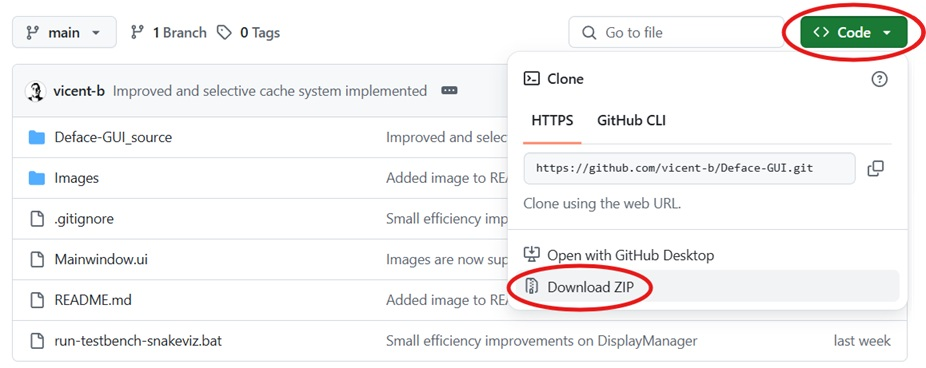

# Deface-GUI
This projet is a GUI for mdraw's "deface" command line tool with frame-per-frame tools, allowing for automatic and quick face censoring for videos. Frame censoring may be necessary for activities such as transparently sharing video training data for Neural Nets or reporter activity without compromising passerby's privacy.


*Image showing the GUI. Video downloaded from pexels.com: [https://www.pexels.com/video/bustling-day-on-istanbul-s-bosphorus-shoreline-32644379/](https://www.pexels.com/video/bustling-day-on-istanbul-s-bosphorus-shoreline-32644379/)*


## Attributions:
This program is just a GUI for the command tool [deface](https://github.com/ORB-HD/deface/) by mdraw. You may find more projects on [https://github.com/vicent-b](https://github.com/vicent-b).

## Information:
You may load a single video or an image. The image on the right shows the conversion of the image or a give video frame (which may be changed using the slider or de number box). The image is shown as it would be after it is processed. It also shows the face detection confidence, a number between 0 (0%) and 1 (100%) which shows the probability of a given area being a face.

The algorithm looks for faces within each image/frame and dettects them with a given confidence (0->1). They are blurred only if the confidence is above the chosen threshold. By changing the threshold you may elliminate false negatives (faces not detected as such) while minimising false positives (non-faces dettected as faces). You can control the slidebar also pressing the arrow keys, allowing to quickly display de video frames at intervals of 0.5 seconds to quickly check if faces stop being blurred in some frames. It is recommended you inspect the final result after saving it.

You may choose to donwscale the video before starting detecting faces to make it faster or correct some errors. You have the explanation in the textbox next to the option.

Blurr method and size may also be chosen. Click export to export the video or images. Video loading and specially video defacing takes a while, so you may see progress bars and messages on the console window. In the future, messages will be shown on the bottom text of graphic interface.


## Installation and GPU acceleration guide
### Windows
In order to use the program, you need to install the Python programming language interpreter from its [webpage](www.python.org). 

It is important to select the option "Add python.exe to PATH". This adds the program location to the PATH variable, which windows uses to search for important files or programs

Then, you must open the command line (write "cmd" in the windows menu search bar) to install the rewuiered packages usong "pip". Pip is a program that comes with python that allows to download and install complemenrs if they are not already installed. Write the following commands:

```console
pip install deface   #original cmd-based deface program
pip install PySide6  #Graphic User Interface tools
```

Moreover, video prpcessing is too slow if done on the CPU, so it is better to use the graphics card. In windows you may use direct-ml:

```console
pip install onnx onnxruntime-directml
```
Finally, if you have an NVIDIA graphics card and CUDA installed, you may instead use:

```console
pip install onnx onnxruntime-gpu
```

To ensure the graphics card is being used instead of the CPU, use the Task Manager when processing a file

Finally, download the project folder and open (run) the file "./Deface-GUI_source/deface_GUI.py" with Python. You can download the latest version of the project by going to the Github page of the project, clicking on the green "< > Code" button and choosing to download the .zip file.


*Image showing how to download the latest version.*

### Linux
Let's be frank: I trust you are tech savvy enough to install Python and the listed dependencies for Windows users.